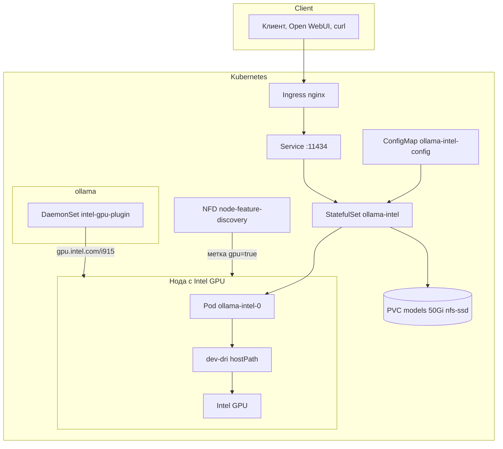

# Ollama on Intel GPU in Kubernetes

Kubernetes-манифесты для развёртывания [Ollama](https://ollama.com/) с ускорением Intel GPU через образ [IPEX-LLM](https://github.com/intel/ipex-llm) (`intelanalytics/ipex-llm-inference-cpp-xpu`).

Проект рассчитан на сценарий, когда в кластере есть **одна (или несколько) нод с Intel GPU** (Arc, Flex, Max, iGPU), и Ollama нужно **жёстко привязать к конкретной ноде**.

## Содержание

- [Возможности](#возможности)
- [Архитектура](#архитектура)
- [Требования](#требования)
- [Структура репозитория](#структура-репозитория)
- [Быстрый старт](#быстрый-старт)
- [Конфигурация](#конфигурация)
- [Использование Ollama](#использование-ollama)
- [Обновление и удаление](#обновление-и-удаление)
- [Диагностика проблем](#диагностика-проблем)
- [Безопасность](#безопасность)
- [Полезные ссылки](#полезные-ссылки)

## Возможности

- **StatefulSet** с постоянным хранилищем моделей (PVC)
- **Intel GPU device plugin** + Node Feature Discovery (NFD)
- **Привязка к конкретной ноде** через `nodeAffinity` / `nodeSelector`
- **Ingress** (nginx) с увеличенными таймаутами для длинных генераций
- **Kustomize** для централизованной настройки образа, namespace и имени ноды

## Архитектура



Компоненты:

| Компонент | Namespace | Назначение |
|-----------|-----------|------------|
| NFD | `node-feature-discovery` | Обнаруживает Intel GPU и проставляет метки на нодах |
| Intel GPU plugin | `ollama` | Регистрирует GPU как ресурс `gpu.intel.com/i915` или `gpu.intel.com/xe` |
| Ollama StatefulSet | `ollama` | Запускает Ollama с IPEX-LLM backend |
| Service | `ollama` | Внутренний доступ к API на порту 11434 |
| Ingress | `ollama` | Внешний HTTP-доступ |

## Требования

### Кластер

- Kubernetes 1.28+ (рекомендуется; device plugin протестирован с [v0.36.0](https://github.com/intel/intel-device-plugins-for-kubernetes/releases/tag/v0.36.0))
- `kubectl` и встроенный `kustomize` (`kubectl apply -k`)
- Ingress Controller (nginx)
- StorageClass для PVC: `nfs-ssd`
- Namespace приложения: **`ollama`** (соответствует ограничениям ArgoCD AppProject `ollama`)

### Нода с Intel GPU

- Linux с поддержкой Intel GPU в ядре
- Установленный драйвер GPU (`i915` или `xe` KMD)
- Доступ к `/dev/dri` на хосте
- Рекомендуемые ресурсы для pod Ollama:
  - CPU: 1 core (request), до 8 cores (limit)
  - RAM: 4 GiB (request), до 16 GiB (limit)
  - GPU: доступ через `hostPath` `/dev/dri` (device plugin опционален)
  - Disk: 50 GiB+ для моделей (PVC `nfs-ssd`)

### Сеть

- При `kubectl apply -k nfd/` нужен доступ к `github.com` (remote kustomize resource)

## Структура репозитория

```
.
├── README.md
├── kustomization.yaml          # Kustomize: Ollama
├── configmap.yaml
├── statefulset.yaml
├── service.yaml
├── ingress.yaml
├── nfd/
│   └── kustomization.yaml      # Node Feature Discovery (отдельно)
├── device-plugin/
│   ├── kustomization.yaml      # Intel GPU plugin (namespace ollama)
│   ├── configmap.yaml
│   ├── intel-gpu-plugin.yaml
│   └── gpu-plugin-target-node.yaml
└── argocd/
    ├── application-device-plugin.yaml  # project: ollama
    └── application-nfd.yaml            # project: default
```

## ArgoCD

AppProject **`ollama`** разрешает только namespace **`ollama`**. Поэтому:

| Application | path | project | destination namespace |
|-------------|------|---------|----------------------|
| `ollama` (Ollama) | `.` | `ollama` | `ollama` |
| `ollama-device-plugin` | `device-plugin` | `ollama` | `ollama` |
| `ollama-nfd` | `nfd` | `default` | `node-feature-discovery` |

```bash
kubectl apply -f argocd/application-nfd.yaml
kubectl apply -f argocd/application-device-plugin.yaml
```

NFD нужно установить **до** device plugin (метка `intel.feature.node.kubernetes.io/gpu=true`).

## Быстрый старт

### 1. Клонировать репозиторий

```bash
git clone https://github.com/vutratenko/ollama-intel-k8s.git
cd ollama-intel-k8s
```

### 2. Настроить параметры

Отредактируйте **оба** ConfigMap — имя целевой ноды должно совпадать:

**`configmap.yaml`** (Ollama):

```yaml
data:
  DEVICE: "Arc"              # Arc | Flex | Max | iGPU
  TARGET_NODE: "gpu-node-01" # kubectl get nodes
```

**`device-plugin/configmap.yaml`**:

```yaml
data:
  TARGET_NODE: "gpu-node-01"
```

Также при необходимости измените:

- `ingress.yaml` — хост (`ollama.example.com`) и TLS
- `statefulset.yaml` — `storageClassName`, лимиты CPU/RAM, тип GPU-ресурса

### 3. Установить NFD и Intel GPU device plugin

```bash
# 1. Node Feature Discovery
kubectl apply -k nfd/

# 2. Дождаться метки GPU на целевой ноде
kubectl get nodes -l intel.feature.node.kubernetes.io/gpu=true

# 3. Intel GPU device plugin (namespace ollama)
kubectl apply -k device-plugin/
```

```bash
kubectl -n ollama get pods -l app=intel-gpu-plugin -o wide
kubectl -n node-feature-discovery get pods
```

Проверьте, что GPU зарегистрирован:

```bash
kubectl describe node cornertop | grep -A5 "Allocatable"
# Ожидается: gpu.intel.com/i915: 1  (или gpu.intel.com/xe: 1)
```

> **NFD уже установлен?** Пропустите `kubectl apply -k nfd/`.

### 4. Развернуть Ollama

```bash
kubectl apply -k .
```

Проверить статус:

```bash
kubectl -n ollama get pods -o wide
kubectl -n ollama logs -f statefulset/ollama-intel
```

### 5. Проверить API

```bash
# Через port-forward (без Ingress)
kubectl -n ollama port-forward svc/ollama-intel 11434:11434

curl http://localhost:11434/
curl http://localhost:11434/api/tags
```

Через Ingress (после настройки DNS):

```bash
curl http://ollama.example.com/api/tags
```

## Конфигурация

### ConfigMap `ollama-intel-config`

| Параметр | По умолчанию | Описание |
|----------|--------------|----------|
| `DEVICE` | `Arc` | Тип Intel GPU для `ipex-llm-init` |
| `TARGET_NODE` | `gpu-node-01` | Имя ноды; подставляется в `nodeAffinity` через kustomize |
| `INTEL_GPU_RESOURCE` | `gpu.intel.com/i915` | Справочное значение; ресурс задаётся в `statefulset.yaml` |
| `ONEAPI_DEVICE_SELECTOR` | `level_zero:0` | Выбор GPU при нескольких устройствах на ноде |
| `OLLAMA_HOST` | `0.0.0.0:11434` | Адрес прослушивания API |
| `OLLAMA_NUM_GPU` | `999` | Offload всех слоёв модели на GPU |
| `OLLAMA_INTEL_GPU` | `true` | Включить Intel GPU backend |
| `ZES_ENABLE_SYSMAN` | `1` | Мониторинг памяти GPU через Level Zero |

### Kustomize replacements

Имя ноды задаётся один раз в `configmap.yaml` и автоматически попадает в StatefulSet:

```yaml
replacements:
  - source:
      kind: ConfigMap
      name: ollama-intel-config
      fieldPath: data.TARGET_NODE
    targets:
      - select:
          kind: StatefulSet
          name: ollama-intel
        fieldPaths:
          - spec.template.spec.affinity.nodeAffinity...
```

Аналогично для device plugin в `device-plugin/kustomization.yaml`.

### Драйвер xe вместо i915

На новых ядрах Linux Intel GPU может работать через KMD `xe`. В этом случае:

1. В `statefulset.yaml` замените лимит ресурса:

   ```yaml
   limits:
     gpu.intel.com/xe: "1"   # вместо gpu.intel.com/i915
   ```

2. Убедитесь, что Intel GPU plugin зарегистрировал `gpu.intel.com/xe` на ноде.

### Plugin на всех GPU-нодах

Если plugin нужен не только на одной ноде, удалите patch из `device-plugin/kustomization.yaml`:

```yaml
patches:
  # - path: gpu-plugin-target-node.yaml
```

### Ingress и TLS

Пример включения TLS через cert-manager (раскомментируйте в `ingress.yaml`):

```yaml
metadata:
  annotations:
    cert-manager.io/cluster-issuer: letsencrypt-prod
    ingress.kubernetes.io/force-ssl-redirect: "true"
spec:
  tls:
    - hosts:
        - ollama.example.com
      secretName: ollama-intel-tls
```

Аннотации `proxy-read-timeout` и `proxy-send-timeout` (600s) нужны для длинных ответов LLM.

### Хранилище моделей

Модели сохраняются в PVC, смонтированном в `/root/.ollama`:

```yaml
volumeClaimTemplates:
  - metadata:
      name: models
    spec:
      storageClassName: nfs-ssd
      resources:
        requests:
          storage: 50Gi
```

Том создаётся на NFS и может монтироваться на любой ноде с доступом к `nfs-ssd`.

## Использование Ollama

### Загрузка модели

```bash
kubectl -n ollama exec -it ollama-intel-0 -- bash -c \
  'cd /llm/ollama && ./ollama pull llama3.2'
```

### Генерация через API

```bash
curl http://ollama.example.com/api/generate -d '{
  "model": "llama3.2",
  "prompt": "Explain Kubernetes in one paragraph.",
  "stream": false
}'
```

### Список моделей

```bash
curl http://ollama.example.com/api/tags
```

### Интеграция с Open WebUI

Укажите Ollama URL: `http://ollama-intel.ollama.svc.cluster.local:11434` (внутри кластера) или внешний Ingress URL.

## Обновление и удаление

### Обновить образ

Измените тег в `kustomization.yaml`:

```yaml
images:
  - name: intelanalytics/ipex-llm-inference-cpp-xpu
    newTag: "2.2.0-SNAPSHOT"
```

Применить:

```bash
kubectl apply -k .
kubectl -n ollama rollout status statefulset/ollama-intel
```

### Удалить Ollama (сохранить PVC)

```bash
kubectl delete -k . --ignore-not-found
# PVC models-ollama-intel-0 останется
```

### Полное удаление включая модели

```bash
kubectl delete -k . --ignore-not-found
kubectl -n ollama delete pvc -l app.kubernetes.io/name=ollama-intel
```

### Удалить device plugin

```bash
kubectl delete -k device-plugin/ --ignore-not-found
```

## Диагностика проблем

### Pod в Pending

```bash
kubectl -n ollama describe pod ollama-intel-0
```

Частые причины:

| Событие | Решение |
|---------|---------|
| `Insufficient gpu.intel.com/i915` | GPU plugin не обязателен — доступ через `/dev/dri`. Если нужен plugin, раскомментируйте лимит в `statefulset.yaml` |
| `Insufficient cpu` / `Insufficient memory` | Уменьшить `resources.requests` в `statefulset.yaml` под allocatable ноды |
| `didn't match node affinity` | Проверить `TARGET_NODE` в ConfigMap |
| `had untolerated taint(s)` | Посмотреть taint: `kubectl describe node cornertop \| grep Taint`; в манифесте уже есть `tolerations: operator: Exists` |
| `PersistentVolumeClaim not bound` | Проверить StorageClass на целевой ноде |

### GPU не используется

```bash
kubectl -n ollama exec -it ollama-intel-0 -- sycl-ls
kubectl -n ollama logs ollama-intel-0 | grep -i gpu
```

Убедитесь, что:

- `OLLAMA_NUM_GPU=999`
- `DEVICE` соответствует реальному GPU
- `/dev/dri` доступен (`ls -la /dev/dri` внутри pod)

### Ollama не отвечает на probes

Первый запуск может занять несколько минут (инициализация IPEX-LLM). Startup probe настроен на ~5 минут (`failureThreshold: 30`, `periodSeconds: 10`).

```bash
kubectl -n ollama logs -f ollama-intel-0
# Лог Ollama: /llm/ollama/ollama.log
```

### Plugin не стартует на ноде

```bash
kubectl -n ollama logs -l app=intel-gpu-plugin
kubectl describe node <node-name> | grep intel.feature
```

Проверьте драйвер на хосте:

```bash
ls -la /dev/dri/
dmesg | grep -i i915
```

## Безопасность

- **Ollama API не имеет встроенной аутентификации.** Не публикуйте Ingress в интернет без reverse proxy с auth (OAuth2 proxy, Authentik, Basic Auth на nginx и т.п.).
- Pod запускается с `privileged: true` для доступа к `/dev/dri`. Если Intel GPU plugin с CDI работает в вашем кластере без privileged — попробуйте выставить `privileged: false`.
- Не коммитьте реальные TLS-секреты, kubeconfig и `.env` с credentials.
- Рекомендуется ограничить Ingress по IP или использовать internal LoadBalancer.

## Полезные ссылки

- [IPEX-LLM — Ollama Quickstart](https://ipex-llm.readthedocs.io/en/latest/doc/LLM/Quickstart/ollama_quickstart.html)
- [IPEX-LLM Docker Guide (XPU)](https://github.com/intel/ipex-llm/blob/main/docs/mddocs/DockerGuides/docker_cpp_xpu_quickstart.md)
- [Intel Device Plugins for Kubernetes](https://github.com/intel/intel-device-plugins-for-kubernetes)
- [Intel GPU Plugin README](https://github.com/intel/intel-device-plugins-for-kubernetes/blob/main/cmd/gpu_plugin/README.md)
- [Ollama API Reference](https://github.com/ollama/ollama/blob/main/docs/api.md)

## Лицензия

Манифесты распространяются свободно. Образ `intelanalytics/ipex-llm-inference-cpp-xpu` и компоненты Intel GPU plugin имеют собственные лицензии — см. документацию upstream-проектов.
